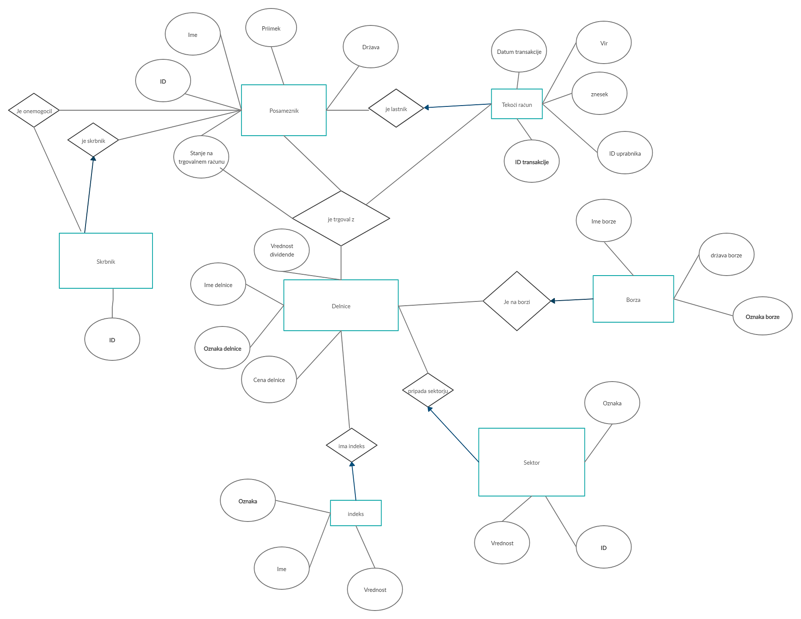

# Borza

V našem projektu bomo naredili podatkovno bazo za virtualno borzo skupaj z spletno aplikacijo. 
Na borzo se prijavi uporabnik, ki je lahko navadni vlagatelj ali pa tudi nadzornik. 
Vlagatelj si lahko na tekoči račun nakaže denar, s katerim lahko nakupuje na borzi. 
Ob nakupu delnic se mu poveča stanje na njegovem trgovalnem računu, ki predstavlja vrednost delnic, ki jih ima v lasti.
Ob prodaji delnic, ki jih ima uporabnik v lasti, se poveča stanje na tekočem računu in to stanje lahko uporabnik dvigne iz borze nazaj v svoj žep.
Delnice so opremljene z večimi lastnostmi, po katerih bo potencialni kupec lahko iskal najprimernejšo delnico za njegovo naložbo.

